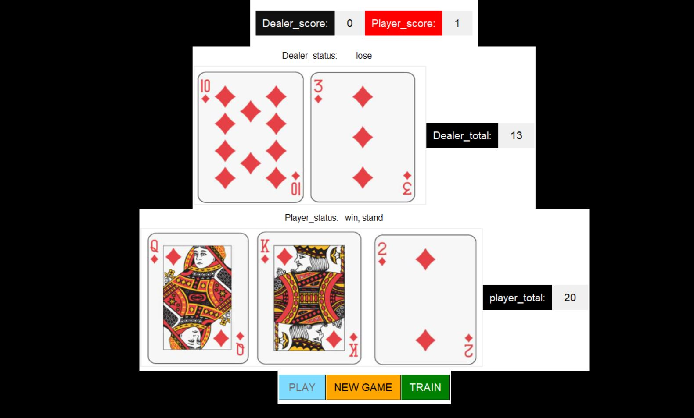
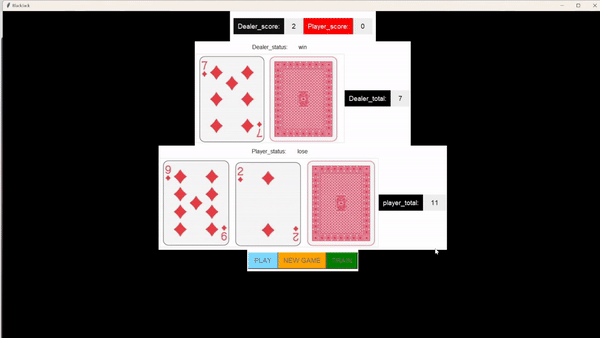

# BlackjackAI: A Neural Network-Powered Blackjack Game



## Overview

BlackjackAI is a Python application that simulates the classic blackjack game using a Tkinter-based graphical interface. The application features a neural network that is trained to compete against the dealer. Users can train the model by clicking the "Train" button, which generates training data by automatically playing games against the dealer and recording the outcomes. The model learns to maximize wins based on the input card combinations.

## Features

- **Blackjack Gameplay:** Play blackjack against the dealer with a graphical interface.
- **Neural Network Training:** Train the AI model to compete against the dealer by generating and using training data.
- **Automatic Data Generation:** The application automatically generates training data by playing games and recording wins and losses.
- **Model Optimization:** The neural network is trained to maximize wins based on the input card combinations.

## Installation

To run BlackjackAI, you need to have the following Python libraries installed:

- `tkinter`
- `numpy`
- `pandas`
- `matplotlib`
- `tensorflow`
- `PIL`

You can install these dependencies using pip:

```bash
pip install numpy pandas matplotlib tensorflow pillow
```

## Running the Application

To start the application, run the following command:

```bash
python black_jack_board.py
```

## Neural Network Model

The main neural network model is implemented in `blackjack_AI.py`. The training data is saved in the CSV file `BlackJack_training_data.csv`.

## Demonstration

Check out the GIF demonstration of the application below:




## License

This project is licensed under the MIT License.

